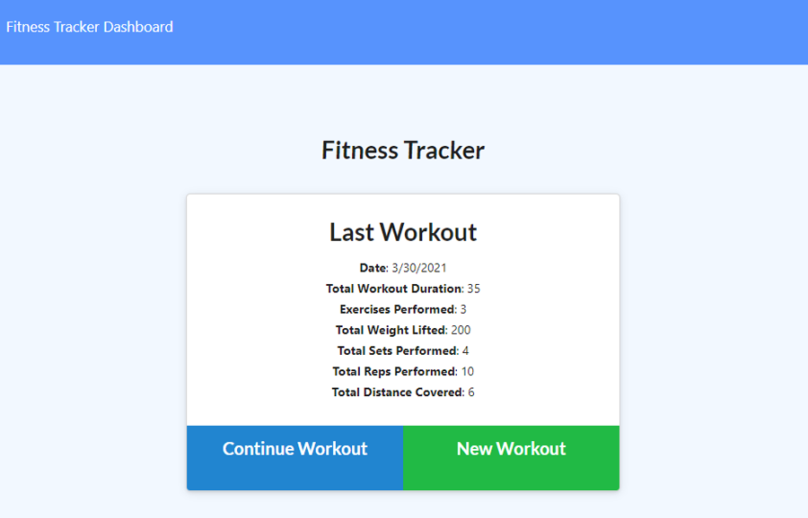

# workout-tracker
[](https://opensource.org/licenses/ISC)
## Description
A web application that lets a user track workouts and exercises. The last workout can be viewed. A stats page is available that presents several graphs and charts about the last 7 days of exercise.

Runs an Express server using Mongoose to handle MongoDB on the back-end.

## Table of Contents
* [Installation](#Installation)
* [Usage](#Usage)
* [Screenshot](#Screenshot)
* [Deployment](#Deployment)
* [License](#License)
* [Questions](#Questions)
* [Credits](#Credits)

## Installation
Install the application with
```
npm install
```

You can provision a local database called "workout" with sample data using
```
npm seed
```

## Usage
A MongoDB server must be available. You may set it up with this environment variable:
```
MONGODB_URI = full URI to MongoDB server
```
If this value is not defined, the application will default to using a localhost database called "workout".


The server can then be run with
```
npm start
```

## Screenshot
  

## Deployment
This application has been deployed on Heroku at https://malenchite-workout.herokuapp.com/

## License  
This application is covered under the **ISC** license. More info can be found here: [ISC](https://opensource.org/licenses/ISC)

## Questions
Questions about the project? You can contact me at malenchite@gmail.com or check out my GitHub profile at [malenchite](https://github.com/malenchite)

## Credits
#### Key NPM Packages
* [mongoose](https://www.npmjs.com/package/mongoose)
* [express](https://www.npmjs.com/package/express)
* [morgan](https://www.npmjs.com/package/morgan)

Front-end starter code was provided as part of an assignment for the UNC Coding Bootcamp.


